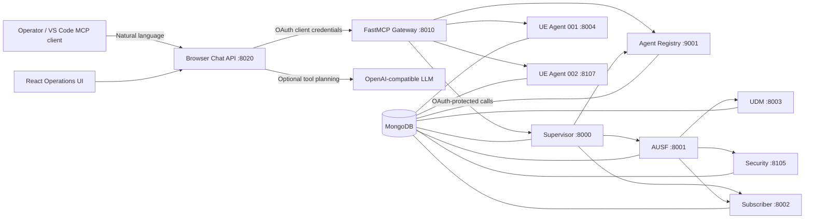

# 6G Agentic AI Core Network and Operations Center

## Project Report

**Report date:** 2 October 2026  
**Project location:** `a2a_architetcture/6g_agentic_ai`

## 1. Executive Summary

This project is a local, multi-agent 6G core-network prototype with an industrial-robot task interface. It combines independently hosted FastAPI services, Agent-to-Agent (A2A) communication, a registry of agent capability cards, OAuth 2.0 / OpenID Connect access control using Keycloak, MongoDB persistence, and an authenticated Model Context Protocol (MCP) gateway. An optional OpenAI-compatible language model can interpret chat requests and select from the gateway's live tool definitions. Without that model, the chat service uses the MCP tools' descriptions and input schemas for lightweight local selection.

The React operations center provides navigation for factory simulation, agent topology, MCP tools, security, tasks, analytics, and logs. The chat experience now presents a request and its task-specific result together: the interface keeps the conversation visible, classifies returned MCP calls into a relevant visualization, and presents waiting, confirmation, accepted, completed, and failed states. The factory production line remains a distinct, explicitly labeled simulation rather than being triggered by ordinary user commands.

The system demonstrates service discovery, authenticated inter-agent requests, UE attach/authentication, QoS/service lookups, peer messaging, industrial robot registration, and validated task assignment. It is a prototype rather than a complete production 6G deployment: robot task calls record acceptance and queue state, but do not provide physical telemetry or a live execution event stream.

## 2. Background and Problem Statement

An agent-based core-network environment needs a way to discover service capabilities, delegate operations to the correct agent, secure service-to-service communication, and inspect outcomes. Hard-coded point-to-point integrations make agents difficult to add and make operations harder to audit. This project uses capability-advertising Agent Cards, registry-based skill discovery, and a common A2A request pattern. MCP exposes selected capabilities to clients such as the browser chat UI or VS Code, while OAuth scopes gate operations.

The project also explores an operator-facing interface for managing robot agents as network-connected entities. The UI combines a factory-floor demo with real backend controls; the boundary between those two modes is now made explicit so that simulated robot motion is not mistaken for a confirmed backend action.

## 3. Project Objectives

- Implement discoverable 6G core and UE/robot services as independent agents.
- Advertise agent names, endpoints, skills, profiles, and metadata through Agent Cards.
- Route inter-agent calls by registered skill using the A2A client.
- Require OAuth access tokens and scopes for protected operations.
- Provide an MCP gateway for tool, resource, and diagnostic-prompt access.
- Support chat-based requests with optional language-model tool selection and a schema-based fallback.
- Validate robot task skill and payload requirements, assign suitable agents, and queue work per agent.
- Provide a browser operations center for system visibility and a separately identified factory simulation.

## 4. System Architecture

The Python services are launched as separate Uvicorn processes by `run_all.py`, in dependency-aware startup order. MongoDB and Keycloak are external prerequisites. The MCP gateway and browser chat service are started separately. The React development server proxies API traffic to the browser chat service; a production Vite build is emitted into `chat_static`, which `chat_app.py` serves.



### 4.1 Services and Ports

| Service | Port | Responsibility |
| --- | ---: | --- |
| Agent Registry | 9001 | Register and retrieve Agent Cards; locate agents by skill. |
| Notification Agent | 8106 | Forward agent-card changes to the Supervisor workflow. |
| Supervisor Agent | 8000 | Orchestrate authentication, service requests, profile queries, and sessions. |
| AUSF Agent | 8001 | Coordinate Agent-AKA authentication and low-trust recovery. |
| Subscriber Agent | 8002 | Return QoS/service-plan data and update subscriber sessions. |
| UDM Agent | 8003 | Return subscriber/profile data, generate authentication vectors, and re-verify subscribers. |
| Security Agent | 8105 | Calculate trust and risk levels and re-evaluate trust after verification. |
| UE Agent 001 | 8004 | UE instance with attach, service-request, peer-message, profile, and task endpoints. |
| UE Agent 002 | 8107 | Second separately configured UE instance. |
| FastMCP Gateway | 8010 | OAuth-protected MCP tools, resources, and diagnostic prompt. |
| Browser Chat API | 8020 | Serve the built UI and proxy browser chat requests to the MCP gateway. |
| Vite development UI | 3000 | React/TypeScript development server; proxies `/api` and `/ws` to port 8020. |

**Port note:** `run_all.py` configures UE Agent 002 on port `8107`. One quick-check bullet in the README says `8007`; use `8107`, which is the launcher configuration and the other topology references.

### 4.2 Main Request Paths

**UE authentication:** The chat or MCP client requests an attach/authentication operation. The Supervisor delegates authentication to AUSF. AUSF retrieves vectors from UDM, asks the Security Agent for trust/risk, and can request UDM re-verification followed by a security re-evaluation when the trust result is low. The Supervisor updates the subscriber session after successful authentication. The result can include authentication method, trust score, risk level, QoS, service plan, and recovery data.

**Service request:** The Supervisor obtains QoS/service-plan data from the Subscriber Agent and returns the requested service with its QoS classification and plan.

**Robot task assignment:** The MCP `assign_task` operation validates the task, advertised skill, and payload. If no agent is specified, the gateway finds capable agents and selects according to skill match, payload capacity, and current task load. It persists a task record, calls the agent task endpoint, and returns the assigned agent and result. A UE task endpoint accepts supported work, enforces its own payload limit, and records the task as `active` or `queued` depending on existing work. Ending a task session can activate the next queued task.

**A2A messaging:** The gateway resolves sender and recipient UE agents through the registry, then routes authenticated messages to the recipient or broadcasts to registered UE agents. Receivers save messages in the inbox store.

## 5. Backend Components

### 5.1 Registry and Agent Cards

Each service publishes an Agent Card containing identity, URL, description, skills, and metadata. The registry supports registration/update, listing, lookup by ID, and lookup by skill. Agents generally register at startup through the notification-to-supervisor path; selected bootstrap agents register directly so the rest of the topology can be discovered.

### 5.2 A2A Client

`shared/a2a_client.py` obtains client-credentials tokens and uses JSON-RPC-style payloads for protected calls. It supports direct calls to known URLs, lookup-and-call by skill, direct calls to an agent ID, registration, notifications, and retrying registration while dependencies start.

### 5.3 MCP Gateway

`mcp_server.py` uses FastMCP Streamable HTTP at `http://localhost:8010/mcp`. Its access-token verifier introspects tokens with Keycloak and requires the `mcp:execute` scope. The gateway delegates operations to existing services rather than implementing duplicate domain logic.

The exposed tools include:

- `6g_agentic_ai/tests/` — OAuth, MCP tool, and chat API tests.

### Agent Registry and A2A Layer

Each service advertises an Agent Card with a name, endpoint, metadata, and one or more skills. Agents register at startup, and the registry supports agent listing, lookup by ID, and skill discovery. The shared `A2AClient` resolves a skill through the registry and sends JSON-RPC requests to the endpoint associated with that skill. Peer UE messaging resolves the destination agent card before delivery.

The Notification Agent accepts card changes and forwards them to the Supervisor, which updates the registry. Some bootstrap services register directly so that the notification and registry path can be established.

### Core Network Workflows

- **UE authentication/attach:** The Supervisor routes the request to AUSF. AUSF obtains authentication vectors from UDM and trust/risk information from Security. Low trust can trigger UDM re-verification followed by a Security re-evaluation. Authentication results may include the method, IMSI, trust score, risk level, and recovery information.
- **Subscriber service/QoS:** The Subscriber Agent looks up the subscriber's QoS class and service plan and can create or update an active session.
- **Profiles:** UDM stores and returns UE and AF profile data along with subscriber information and authentication vectors.
- **A2A communication:** UE agents accept authenticated peer messages and broadcasts, and expose message inboxes.
- **Robot task assignment:** The MCP task function validates task text, skill compatibility, payload weight, and advertised robot capability. When a robot is not explicitly selected, it chooses a capable, matching agent with capacity and lower active load. The robot endpoint returns an accepted task record, which can be active or queued.

### MCP Gateway

The gateway is implemented with FastMCP over Streamable HTTP at `/mcp`. It verifies incoming OAuth tokens through Keycloak and requires the `mcp:execute` scope. Registered tools cover robot registration and authentication, task assignment and task-session management, agent/robot discovery, inbox retrieval, agent lookup, and active-session listing. The server also defines internal orchestration helpers for UE attach, service requests, peer messaging, subscriber-profile lookup, and higher-level Supervisor workflows; helper functions are distinct from public MCP tool registrations.

MCP resources expose agent cards, active sessions with opaque identifiers redacted, and network topology. A diagnostic prompt template is also provided. The gateway sanitizes agent cards and session records before returning them and avoids placing secrets in browser code.

### Browser Chat and Language Model Integration

`chat_app.py` exposes `/api/status`, `/api/chat`, `/api/agents`, `/api/inbox/{agent_id}`, and `/api/robot-simulation`. It connects to the existing MCP gateway using server-side client credentials and discovers tool definitions from the live gateway.

When `LLM_API_KEY` is configured, chat sends the available tool schemas to an OpenAI-compatible chat-completions API, executes approved tool calls through MCP, and returns the final response and tool steps. When no key is configured, local schema/description-based matching selects a tool. Missing required parameters prompt for more input; operations marked as dangerous (including task assignment and agent registration) require confirmation. Conversation context and pending confirmations are stored in process memory, not durable storage.

### Operations Console

The React + TypeScript + Vite interface keeps the chat and task workspace together. The task view classifies the returned tool and renders relevant details for robot assignment, agent discovery, UE authentication, service requests, peer messages, and query results. It shows the command, assistant response, status, returned tool arguments/results, and duration where present. Sensitive-looking argument fields are redacted in the UI.

The shell retains Factory Overview, Agent Network, MCP Control Center, Security Center, Task Management, Analytics, and System Logs navigation. Backend connectivity is displayed from `/api/status`; fixture-backed data is labeled as demo data. The order-104 factory production scenario and failure/recovery actions are frontend simulations and remain separate from ordinary chat commands.

The Vite build writes to `../chat_static`, allowing `chat_app.py` to serve the built experience. `npm run build` runs TypeScript checking before bundling.

## Data and Persistence

The default persistence adapter uses Motor/PyMongo with a configured MongoDB URI. Collections are used for subscriber profiles, sessions, agent cards, UE/AF profiles, messages, tasks, MCP sessions, and OAuth audit metadata. If MongoDB cannot be reached, `database.py` provides an in-memory fallback for local development. Data in this fallback is temporary and disappears when the process exits.

`seed.py --reset` clears and recreates sample application data while preserving selected MCP/OAuth collections. It is destructive to existing application data in the configured database and should only be used with a disposable or backed-up development database.

## Security Design

- Keycloak is the configured OAuth 2.0/OIDC issuer and token endpoint.
- Service agents validate bearer tokens through introspection, including issuer, audience, expiry, active status, and required scope.
- Inter-agent clients use the OAuth client-credentials flow and cache access tokens in process memory.
- MCP requests require `mcp:execute`; individual agents enforce operation-specific scopes such as `agent:write`, `authentication:request`, and subscriber/security/network scopes.
- The Keycloak setup script provisions a local realm, clients, scopes, audience mappers, and local environment secrets.
- OAuth audit records store token fingerprints/hashes and metadata rather than raw incoming access tokens.
- LLM credentials and service-client secrets belong in the server-side `.env`; they must not be checked in or placed in frontend files.

This is a local prototype configuration. Production deployment would require deployment-grade secret management, transport security, hardened service exposure, and a reviewed authorization policy.

## Technology Stack

| Area | Technologies |
| --- | --- |
| Backend APIs | Python, FastAPI, Uvicorn, Pydantic, HTTPX |
| Agent/tool protocol | JSON-RPC-style A2A requests, FastMCP, Streamable HTTP |
| Identity | Keycloak, OAuth 2.0 client credentials, OIDC token introspection |
| Persistence | MongoDB with Motor/PyMongo; in-memory local fallback |
| Frontend | React 18, TypeScript, Vite, Tailwind CSS, Lucide icons, Recharts, Framer Motion dependency |
| Tests | Pytest, pytest-asyncio, HTTPX ASGI transport, mock transports and async mocks |

## Setup and Running the Project

Prerequisites include Python 3.10 or later, Node.js/npm for frontend development/build, MongoDB or a MongoDB Atlas URI, and a local Keycloak server. The repository does not include Docker Compose.

1. Configure the local `.env` using the documented variables. Do not include actual secrets in a report or commit.
2. Create and activate a Python virtual environment, then install `6g_agentic_ai/requirements.txt`.
3. Start MongoDB and Keycloak; run `setup-keycloak.ps1` to provision realm/client configuration.
4. From `6g_agentic_ai`, seed sample data when needed with `python seed.py --reset` (destructive; use only for sample data).
5. Start core services with `python run_all.py`.
6. In another terminal, start the MCP gateway with `python mcp_server.py`.
7. Start the browser service with `python chat_app.py`; open `http://127.0.0.1:8020`.
8. For frontend development, run `npm install` and `npm run dev` from `6g_agentic_ai/frontend`. The Vite server runs on port 3000 and proxies API requests to the browser service.

## Tests and Verification

The Python test suite is run from `6g_agentic_ai` with:

```powershell
python -m pytest -v
```

Current tests cover OAuth client token caching, missing/inactive/wrong-issuer/wrong-scope token handling, chat separation of LLM and MCP errors, UE task endpoint acceptance, inbox task records, active/queued task lifecycle, least-loaded capable robot selection, skill/task mismatch validation, automatic skill matching, and robot registration behavior.

The frontend production build uses:

```powershell
npm run build
```

The current frontend package does not define a dedicated automated unit-test or browser-test script. During the UI implementation, the TypeScript/Vite production build passed and the browser workflow was exercised with mocked API replies for discovery, missing input, confirmation, accepted robot assignment, errors, and responsive layouts. These mocked checks do not replace integration testing against a running Keycloak/MongoDB/MCP deployment.

## Current Limitations and Risks

1. **No live task-progress stream:** `/api/chat` returns after the MCP/tool request completes or asks for input/confirmation. It does not stream internal agent stages. `/api/robot-simulation` is a latest-execution summary, not a durable task-status feed.
2. **No physical robot telemetry/control integration:** The generic robot agent validates and records software task requests. It does not move real hardware. The factory-floor production sequence and robot movement shown in the demo are simulated.
3. **WebSocket is not an agent event bus:** The current `/ws` handler echoes received client text as an event; it is not connected to task lifecycle events from backend agents.
4. **In-memory chat state:** Conversation history, pending confirmations, and latest execution data in `chat_app.py` are process-local and are lost on restart; latest-execution state is shared at process scope rather than scoped per user.
5. **Fixture-backed dashboards:** Security metrics, analytics, initial robot/agent state, and production-order examples are initialized in the frontend. They should not be interpreted as live backend telemetry unless separately wired to an authoritative API.
6. **Local deployment assumptions:** Services bind to local ports, Keycloak and MongoDB are external prerequisites, and there is no container orchestration/deployment configuration checked in.
7. **Port documentation inconsistency:** UE Agent 002 is configured on port `8107` in `run_all.py`, while a README quick-check entry says `8007`.

## Recommended Future Work

- Add a durable task-run API with stable run IDs, persisted lifecycle states, timestamps, structured events, and per-conversation ownership.
- Publish backend task/agent updates through SSE or a WebSocket event broker; include reconnect/resume semantics and authorization.
- Connect task assignment, UE sessions, registry data, security metrics, analytics, and system logs to authoritative API results instead of frontend fixtures.
- Integrate robot telemetry or a clearly bounded simulator with position/status events before displaying animated physical movement.
- Add frontend unit/component tests and browser automation to CI for successful results, waiting states, confirmations, cancellation, nested tool errors, offline behavior, and mobile layouts.
- Correct the UE-002 README port entry and consolidate service topology information so launcher, documentation, and UI remain aligned.
- Add container/deployment configuration and production hardening for secrets, TLS, service networking, persistence, observability, and authorization.

## Conclusion

The project demonstrates an end-to-end prototype for agent discovery, secured A2A service composition, MCP-mediated tool execution, UE/network workflows, and software-based robot task scheduling. Its most important architectural strength is separating the MCP-facing control plane from individual agents and resolving capabilities through registry-advertised skills. The current UI now reflects returned tool data without claiming physical progress, while the explicit factory scenario remains a simulation. Durable task orchestration, real-time event delivery, live telemetry, and production deployment hardening are the primary steps needed to move from prototype demonstration to operational system.

## 15. Key Source Files

- `README.md` — installation, environment configuration, startup, and architecture overview.
- `6g_agentic_ai/run_all.py` — core service launcher.
- `6g_agentic_ai/mcp_server.py` — FastMCP tools, resources, prompt, and OAuth verification.
- `6g_agentic_ai/chat_app.py` — browser chat API, tool selection, optional LLM integration, and static hosting.
- `6g_agentic_ai/shared/a2a_client.py` — authenticated agent discovery and A2A calls.
- `6g_agentic_ai/shared/oauth.py` — token acquisition, introspection, and scope enforcement.
- `6g_agentic_ai/database.py` and `6g_agentic_ai/seed.py` — persistence, offline fallback, and sample data.
- `6g_agentic_ai/frontend/src/App.tsx` — UI state, chat lifecycle, navigation, and demo flow.
- `6g_agentic_ai/frontend/src/components/Chat/TaskWorkspace.tsx` — task-specific visualizations and response states.
- `6g_agentic_ai/frontend/src/pages/FactoryDashboard.tsx` — operations workspace composition.
- `6g_agentic_ai/tests/` — OAuth, chat, and MCP behavior tests.
