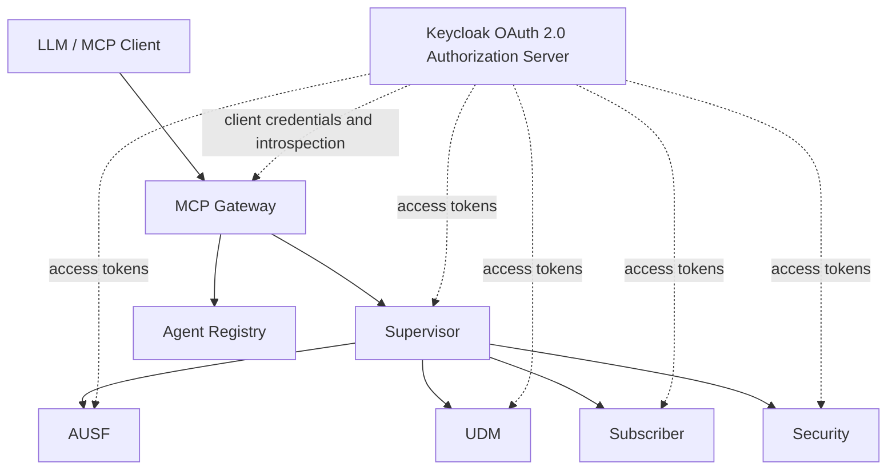

# 6G Agentic AI

A 6G core-network demonstration composed of A2A agents, an agent registry, a Supervisor orchestrator, a FastMCP gateway, and network services including AUSF, UDM, Subscriber, Security, and UE agents.

## Architecture



## OAuth 2.0

Keycloak is the Authorization Server. Each service is registered as a confidential OAuth client and uses the Client Credentials grant for outbound A2A calls. FastAPI services are OAuth Resource Servers: they introspect bearer access tokens and enforce scopes. The application does not issue or validate access tokens.

Typical flow:

```text
Agent -> Keycloak token endpoint -> OAuth access token -> Protected agent -> scope validation
```

The MCP gateway is both an OAuth client for downstream A2A calls and a protected MCP resource. OAuth credentials remain in the gateway infrastructure and are never passed to the LLM.

## Scopes

| Scope | Purpose |
| --- | --- |
| agent:read | Read agent information |
| agent:write | Register or modify agent information |
| authentication:request | Request AUSF/UDM authentication work |
| subscriber:read | Read subscriber and UDM data |
| subscriber:write | Update subscriber sessions |
| security:read | Read trust information |
| security:write | Re-evaluate trust |
| network:read | Read network state |
| network:write | Attach UEs and request services |
| mcp:execute | Execute protected MCP operations |
| automation:execute | Execute automation workflows |

## Setup

1. Start Keycloak and create a realm named `6g`.
2. Create the `6g-agent-services` audience and the scopes listed above.
3. Create one confidential client for each service named in `.env.example`, enable `client_credentials`, and assign only required scopes.
4. Copy `.env.example` to `.env` and fill in the Keycloak client secrets and MongoDB URI.
5. Install dependencies: `pip install -r requirements.txt`.
6. Start MongoDB and seed application data with `python seed.py`.
7. Start the agents and MCP gateway with `python run_all.py`.
8. The MCP endpoint is `http://localhost:8010/mcp`; Registry discovery is `http://localhost:9001/registry/agents`.

`run_all.py` starts the Registry-dependent services and the MCP gateway. Keycloak must already be running before agent traffic is used.

## Tests

Run the local tests with:

```powershell
python -m pytest -v
```

Tests mock the OAuth token and introspection endpoints; no live Keycloak instance is required for unit tests.
